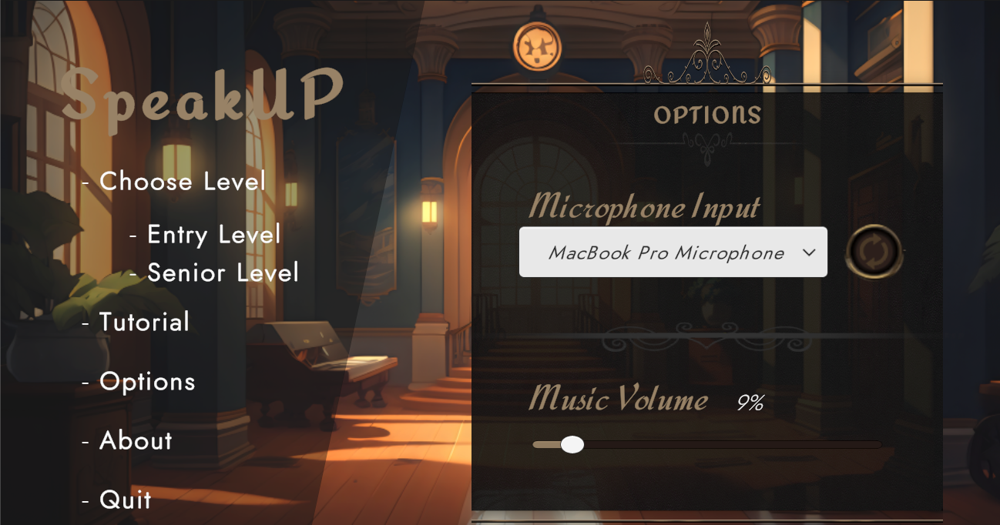
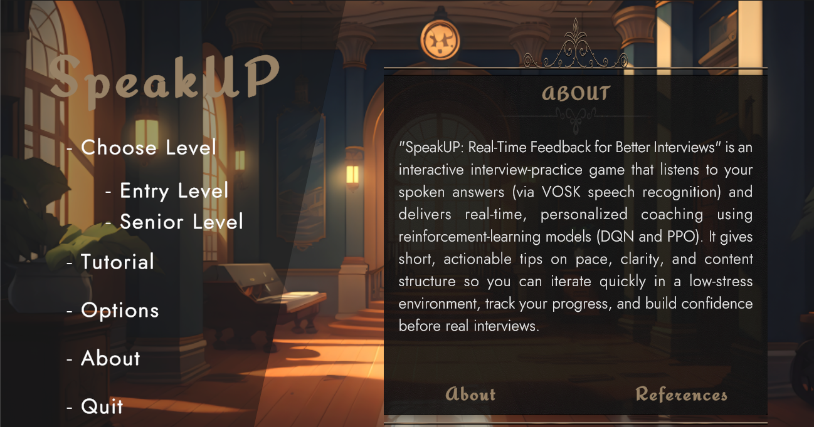
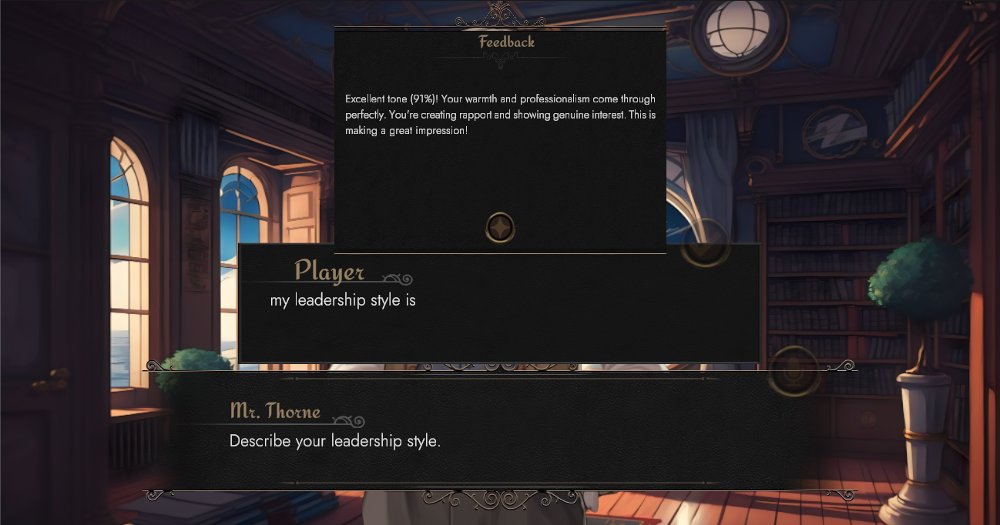
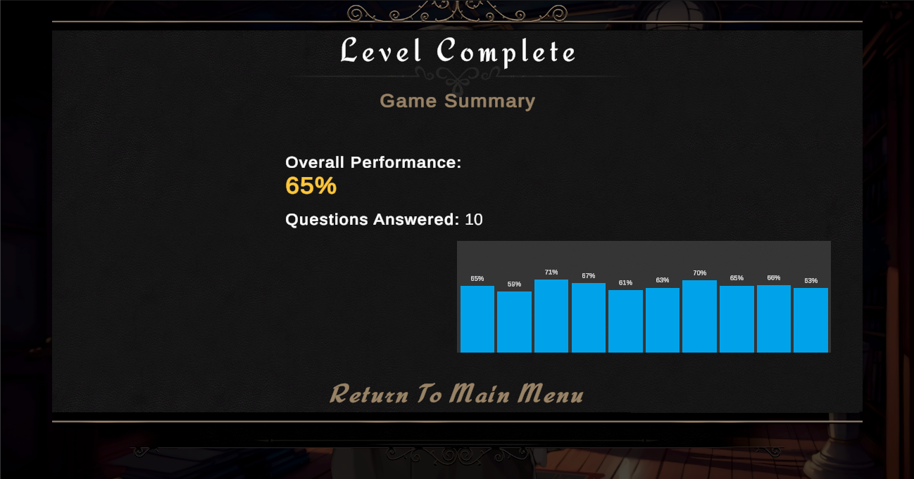

# SpeakUP: Real-Time Feedback for Better Interviews
> [!NOTE]
> This game is a product of a research paper titled: **Adaptive Game Dynamics: Comparing Deep Q-Network and Proximal Policy Optimization for Real-Time Feedback in a Job Interview Training  Simulation A.Y.2025-2026**

## Abstract

What inspired behind the creation of this game?

 
Job interviews can be intimidating, especially for graduating students who are still developing their communication skills. Traditional preparation often means practicing alone or receiving feedback only after the interview, leaving little room for immediate guidance. 

 

**SpeakUP** was developed to make this practice more interactive, engaging, and less stressful. The game simulates behavioral and technical interviews while using speech recognition and adaptive feedback to help players recognize areas they can improve, such as their confidence, clarity, pace, and tone.

 

At the same time, the study explores how **DQN and PPO** can be used to provide personalized, real-time feedback and make interview practice feel less like a test and more like a game.

## Read the Paper
[Research Paper](https://drive.google.com/file/d/1gxCWUJ1i6X9Yx1X3esNu0Yta-cdeYzE0/view?usp=sharing "Adaptive Game Dynamics: Comparing Deep Q-Network and Proximal Policy Optimization for Real-Time Feedback in a Job Interview Training  Simulation")

## Authors
- [Marc Gyronne Gocon](https://github.com/mgocon "Marc Gocon's Profile")
- Joseline Corpuz
- Oliver Deniel Garcia
- Simone Gregor Go

## Game Interface Design

## Game Download
Google Drive: 
- [SpeakUP Windows Version](https://drive.google.com/file/d/1gxyBbMSIf4XBnMeDapKWBJ1ICHxRhsDd/view?usp=sharing "SpeakUP.zip")

- [SpeakUP Apple Silicoon + Intel Version](https://drive.google.com/file/d/1WHuzXhJ-8MO8B848aM8-rBsIw8obcuxM/view?usp=sharing "SpeakUP(Apple).zip")
